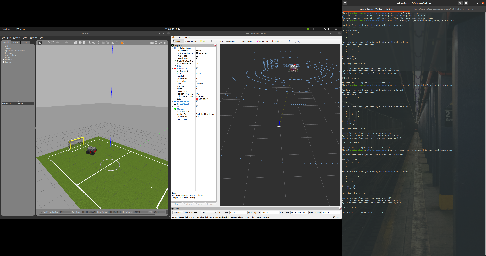

## ROS Installation
Refer to https://github.com/catachiii/ROS_Course/blob/main/Other%20Materials/HowToSetupDeveloperPC_20-04.pdf

## Exercise 1
The task is to create a launch with Robocup14 world and control the robot using keyboard teleop for twist robots.
The final scene from my implementation looks like this:

## Exercise 2
We implemented laser input to the robot and the visualization in rviz tool. We also incorporate parameters for the robot and subscribers.
